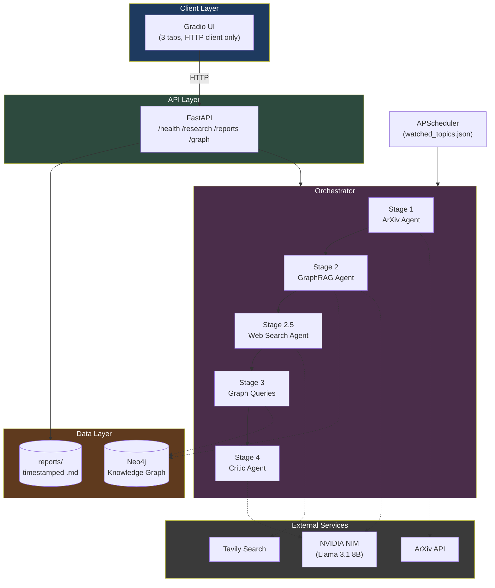

# 🔬 ResearchPilot AI

**An autonomous multi-agent research assistant that searches ArXiv, builds a Neo4j knowledge graph, finds research gaps, and critiques its own output — with a scheduler, REST API, and web UI on top.**

Give it a topic. It finds the papers, extracts the concepts, maps how they connect, searches the wider web for context, writes a structured report, and then grades its own work.

---

## 🎥 Demo


---

## 🧠 What It Actually Does

1. **Searches ArXiv** for papers relevant to your query
2. **Extracts concepts and relationships** from each paper using an LLM, and writes them into a **Neo4j knowledge graph**
3. **Searches the web** (via Tavily) for context beyond academic papers
4. **Finds research gaps** — concepts that show up across multiple papers but have no established relationships in the graph (i.e. under-explored connections)
5. **Generates a structured markdown report** combining all of the above
6. **Critiques its own report** using a second LLM pass, scoring it across five dimensions (relevance, coverage, evidence quality, gap identification, actionability)
7. Can run **on a schedule** against a watchlist of topics, or **on demand** through a web UI

---

## 🏗️ Architecture




---

## 🤖 The Five Agents

| Agent | Job | Notable Design Choice |
|---|---|---|
| **Orchestrator** | Runs all stages in order, isolates failures per-stage | Each stage wrapped in its own `try/except` — one agent crashing never kills the pipeline |
| **ArXiv Agent** | Searches and downloads papers | Uses LangGraph (needs to *reason* about search strategy) |
| **GraphRAG Agent** | Extracts concepts + relationships, writes to Neo4j | Plain Python loop, **not** LangGraph — see [Key Decisions](#-key-decisions) |
| **Web Search Agent** | Finds non-academic context via Tavily | Three-layer defense against LLM null returns |
| **Critic Agent** | Scores the finished report, 0–100 | A **meta-agent** — grades quality, doesn't gate or trigger retries |

> **Is the critic a quality gate?** No — it's a quality *signal*. It scores the report across 5 dimensions and appends the critique to the final markdown, but a low score doesn't block the report or trigger a re-run. That's a deliberate choice: looping based on one LLM's opinion of another LLM's output risks infinite retries for marginal gains, since the "grader" has no ground truth either.

---

## 🛠️ Tech Stack

| Layer | Choice | Why |
|---|---|---|
| LLM | `meta/llama-3.1-8b-instruct` via NVIDIA NIM | Free tier, generous limits, drop-in via `ChatNVIDIA` |
| Agent framework | LangGraph (selectively) | Used only where an agent needs to *decide* what to do next — not for deterministic loops |
| Graph database | Neo4j 5.13 (Docker) | Natural fit for "which concepts connect to which" queries |
| Web search | Tavily (`langchain-tavily`) | LLM-optimized search results, not raw SERP scraping |
| API | FastAPI + Uvicorn | Auto-generated docs, Pydantic validation for free |
| UI | Gradio | Right tool for a fast, functional AI/ML portfolio UI — not trying to be a product |
| Scheduler | APScheduler | Simple interval-based job runner, no external infra needed |
| Observability | LangSmith | Full pipeline tracing — see below |
| Structured output | Pydantic + `.with_structured_output()` | Guarantees schema-shaped LLM responses instead of parsing free text |

---

## 📊 Observability: LangSmith Tracing

Every pipeline run is wrapped in a single `@traceable` span around `Orchestrator.run()`, so all five agents' LLM calls within one research query show up as a connected trace tree in LangSmith — not as a dozen disconnected calls with no shared context.

```bash
# .env
LANGCHAIN_TRACING_V2=true
LANGCHAIN_API_KEY=your_key_here
LANGCHAIN_PROJECT=researchpilot-ai
```

This made debugging the "papers found but never analyzed" bug (below) dramatically faster — instead of grepping logs, the trace showed exactly which stage returned an empty list.

---

## 🕸️ Viewing the Knowledge Graph

The Gradio UI's **Graph Stats** tab shows counts (papers / concepts / relationships) pulled through the API. To see the actual *shape* of the graph — which concepts cluster, which papers connect — there's a direct link out to **Neo4j Browser**, pre-loaded with a starter Cypher query.

> This is a deliberate, documented exception to the "UI only talks to the API" rule — the link bypasses the backend entirely. A proper fix would be a custom graph-visualization endpoint (e.g. rendered with Pyvis); this was the pragmatic version shipped under time constraints.

---

## 🚀 Getting Started

### Prerequisites
- Python 3.11+ (3.13 supported — see `requirements.txt` notes on `audioop-lts`)
- Docker (for Neo4j)
- API keys: NVIDIA NIM, Tavily, LangSmith (optional but recommended)

### Setup

```bash
git clone https://github.com/aryan/researchpilot-ai.git
cd researchpilot-ai

python -m venv venv
venv\Scripts\activate          # Windows
# source venv/bin/activate     # macOS/Linux

pip install -r requirements.txt

cp .env.example .env           # then fill in your API keys

docker run -d --name researchpilot-neo4j \
  -p 7474:7474 -p 7687:7687 \
  -e NEO4J_AUTH=neo4j/researchpilot123 \
  neo4j:5.13

python -c "from graph.connection import Neo4jConnection, create_schema; conn = Neo4jConnection(); create_schema(conn); conn.close()"
```

### Run

```bash
# Everything at once (recommended)
python main.py

# UI:  http://127.0.0.1:7860
# API: http://127.0.0.1:8000/docs
```

```bash
# Or run a one-off scheduled batch over watched_topics.json
python scheduler/update_job.py
```

---

## 📁 Project Structure

```
researchpilot/
├── agents/              # 5 agents — orchestrator, arxiv, graphrag, websearch, critic
├── pipeline/             # ArXiv fetching, PDF parsing, Neo4j ingestion
├── graph/                # Connection management + Cypher query layer
├── api/routes.py         # FastAPI — 5 endpoints
├── ui/app.py              # Gradio — 3 tabs, pure HTTP client of the API
├── scheduler/update_job.py # APScheduler — reads watched_topics.json
├── reports/              # Auto-generated, timestamped .md reports
├── config.py
└── main.py                # Starts API + UI together, clean shutdown
```

*Built as a hands-on project — every architectural decision above was made (and several reversed) while building toward an AI/ML Engineer role.*
